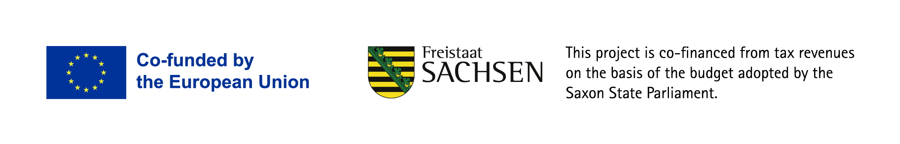

Welcome to The PyRolL Project!

PyRolL is an OpenSource rolling framework, aimed to provide a fast and extensible base for rolling simulation. The
current focus lies on groove rolling using models build on analytical solutions in elongation grooves. 
The project is structured in numerous repositories, where every repository either contains an extension or a plugin to the framework. 
Need more information regarding the way PyRolL works? Check out our [documentation](https://pyroll.readthedocs.io/en/latest)!

## Project Structure
The structure of the project is build around the [pyroll-core](https://github.com/pyroll-project/pyroll-core) repository which hosts the calculation core. 
Generally the version numbers major has to match to use a respective plugin or extension with the core. 

## Documentation

See the [documentation](https://pyroll.readthedocs.io/en/latest) to learn about basic concepts and usage. 

## License

The project is licensed under the [BSD 3-Clause license](../LICENSE).

## Contributing

See our [contribution guidelines](profile/CONTRIBUTING.md).
These apply for every repository of the project. 

## Citing

You worked with PyRolL and published a paper or book chapter? 
Reach out to us and we can discuss featuring your work in our example section of the PyRolL docs.
If you use PyRolL in your work please consider citing the project using the following [paper](https://joss.theoj.org/papers/10.21105/joss.06200).

## Funding

PyRolL is currently support by the SAB and the EFRE programm under the grant number: 100688987.
The corresponding press release can be found using the following [link](https://tu-freiberg.de/news/vom-labor-den-markt-tu-bergakademie-freiberg-erneut-erfolgreich-bei-validierungsfoerderung).
